# VH-Inventory — Product Manual

VH-Inventory is a home **inventory & grocery system** that runs inside Home Assistant. It
lets you track what you own, where it is stored, how much you have, and what you need to
buy — driven either by barcode scanning or manual entry. The interface is fully
multi-language (English / Nederlands out of the box).

> **Audience:** end users of the dashboard. For installation, see `INSTALLATION.md`.

---

## 1. Core concepts

| Concept | Meaning |
|---|---|
| **Product** | A catalogue item (name, barcode, manufacturer, unit, category, store, auto-add settings). Defined once, reused everywhere. |
| **Inventory (Stock)** | How many of a product you currently have, at a **location**. A product only appears here while it has stock — when its stock reaches **0** it drops off the inventory (the product itself and any shopping-list entry are kept). |
| **Location** | Where stock is stored (e.g. *Pantry*, *Garage freezer*). |
| **Category** | A grouping for products (e.g. *Coffee*, *Cleaning*). |
| **Store** | Where you usually buy a product (e.g. *Jumbo*, *Kruidvat*). |
| **Shopping list** | Items you need to buy. Populated manually or automatically. |
| **Scan queue** | A staging area for scanned barcodes awaiting resolution into products. |
| **History** | An audit log of every add/edit/delete action. |

**Auto-Add** is the link between stock and the shopping list: when a product is enabled
for auto-add and its stock drops to/under its **threshold**, the product can be placed on
the shopping list at its configured **quantity**.

**Zero stock is never kept in the inventory.** As soon as a product's total stock reaches
0 it is removed from the Inventory tab, so the list only ever shows what you actually have.
The product definition and its shopping-list entry are untouched, and the product
reappears in the inventory automatically the moment you restock it.

---

## 2. The dashboard at a glance

The dashboard lives at `/vh-inventory/main` and is organised as a row of tabs. Most tabs have
an **Add** button (opens a pop-up), a data table, and per-row **Edit** / **Delete** controls.
**Woonkamer** and **Kantoor** buttons in the footer (right-aligned) jump to those touchscreen
dashboards.

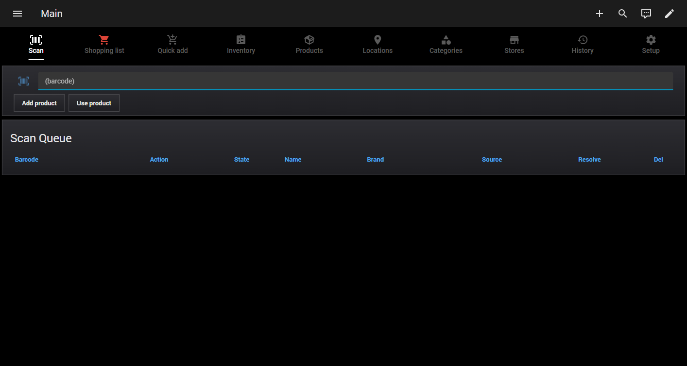

The tabs, left to right:

| Tab | Purpose |
|---|---|
| **Shopping list** | Items to buy; print to a thermal receipt printer (grouped per store). |
| **Quick Shopping** | One-tap add/remove of products on the shopping list, split into two sections. |
| **Quick Inventory** | One-tap remove-from-stock or add-to-stock of products. |
| **Inventory** | Current stock per product, category and location; filter and print by category. |
| **Products** | The product catalogue. |
| **Locations** | Storage locations. |
| **Categories** | Product categories. |
| **Stores** | Shops. |
| **Scan** | Scan or type barcodes; Add/Use flow; resolve unknown items. |
| **History** | Audit log of all changes (latest 50 shown). |
| **Setup** | App settings: language selector, *Show ID columns*, and *Hide header (kiosk)* toggles. |

---

## 3. Setting up your reference data

Before scanning or tracking stock, create the building blocks. Order doesn't strictly
matter, but **Locations**, **Categories** and **Stores** are useful first because products
reference them.

### Locations

Open the **Locations** tab, press **Add**, type the location name, and save.

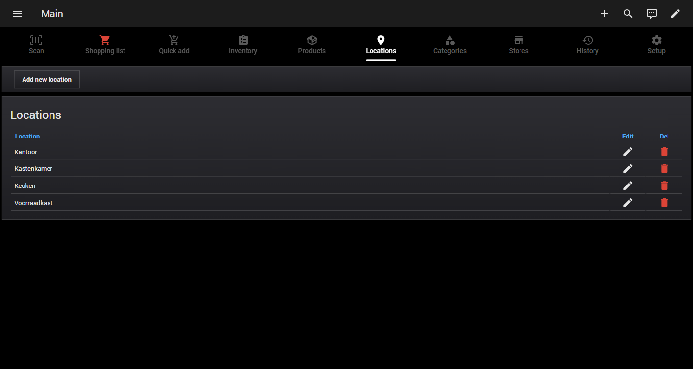

### Categories

Open the **Categories** tab, press **Add**, type the category name, and save.

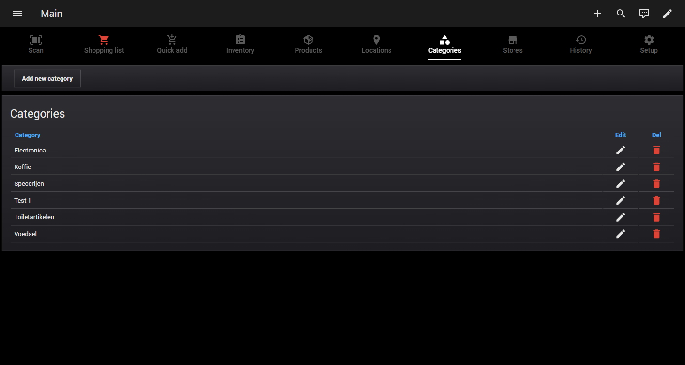

### Stores

Open the **Stores** tab, press **Add**, type the store name, and save.

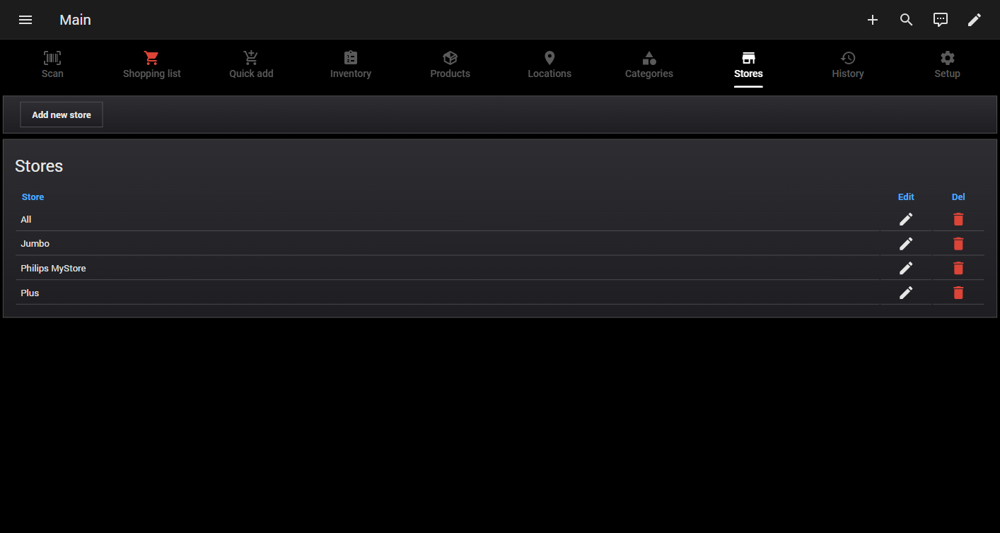

> Newly added locations, categories and stores become immediately available in the
> dropdowns used by products and inventory (the inline pickers refresh on open).

---

## 4. Products

The **Products** tab is your catalogue. Each product carries a name, barcode,
manufacturer, unit, category, store, and its auto-add settings.

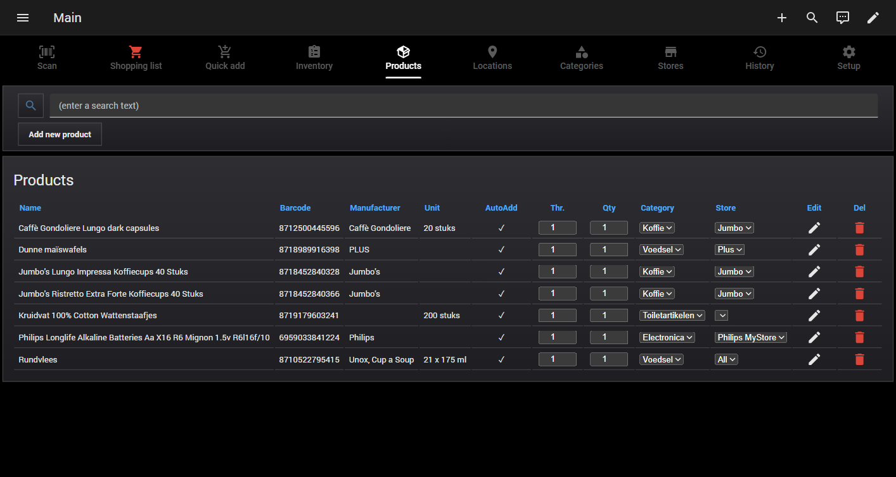

### Adding a product manually

Press **Add** to open the **Add Product** pop-up and fill in the fields:

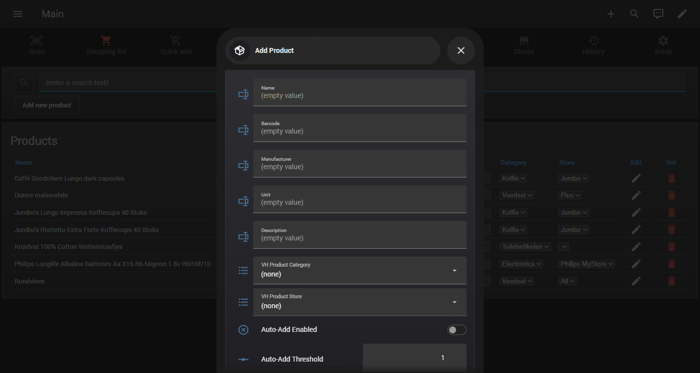

| Field | Notes |
|---|---|
| **Name** | Required. |
| **Barcode** | Optional; numeric. Used to match future scans. |
| **Manufacturer / Unit / Description** | Optional descriptive fields. |
| **Category / Store** | Pick from your reference lists (or `(none)`). |
| **Auto-Add Enabled** | Turn on automatic shopping-list top-up. |
| **Auto-Add Threshold** | Stock level at/under which the item is needed. |
| **Auto-Add Quantity** | How many to put on the shopping list. |

Press **Save** to store the product (the pop-up closes automatically). Use **Cancel** to
discard.

### Editing / deleting a product

Each row has an **Edit** (pencil) and **Delete** (trash) control. Editing opens a pre-filled
pop-up. Deleting a product also removes its related **inventory** and **shopping-list**
rows (cascade delete).

---

## 5. Tracking stock (Inventory)

The **Inventory** tab shows how much of each product you have, its category, and where it
is stored.

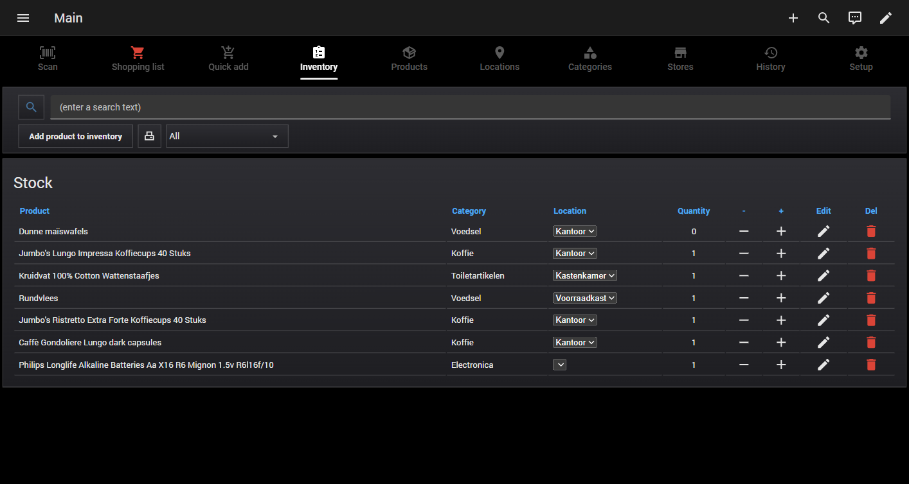

- Press **Add product to inventory** to record stock: pick a product, a location, and a
  quantity.
- Each row shows the product's **Category** and its **Location**, both of which you can
  change inline via a dropdown. (Category is a property of the product, so changing it here
  updates that product everywhere it appears.)
- Quick **+ / –** controls adjust quantity.
- Stock changes feed the auto-add logic and are written to **History**.
- When a product's quantity reaches **0** it disappears from this tab (kept on the shopping
  list if it was auto-added). Restocking it — by scanning **Add** or using *Add product to
  inventory* — brings it back.

### Filtering and printing by category

Next to the *Add product to inventory* button are a **printer** icon and a **category
dropdown**:

- Pick a category from the dropdown to **filter the table** to just that category's
  products. Leave it on **All** to show everything.
- Press the **printer icon** to print the inventory to the thermal printer. The printout is
  grouped by category; if a specific category is selected it prints only that one, otherwise
  it prints every category.

### Handheld scanner mode (Add / Use)

Between the *Add product to inventory* button and the printer icon is a **mode toggle**
button for the [handheld scanner](#7-scanning-workflow). It shows the scanner's current mode
and switches it on tap:

- **Scanner in ADD mode** (cyan by default) — scanned barcodes **increase** stock.
- **Scanner in USE mode** (red by default) — scanned barcodes **consume** stock (and fall
  back to the shopping list, resolving unknown barcodes online first).

The two colours are configurable on the Setup tab (*Handheld scanner → Color Add mode /
Color Use mode*). The mode is shared by every handheld scan until you toggle it again.

> **Tip:** the search box on the Inventory, Products and other tables matches on **product
> name *or* barcode** — type any part of either to filter.

---

## 5a. Quick Shopping

The **Quick Shopping** tab is the fastest way to build a shopping list. Every product is shown
as a button, split into two sections:

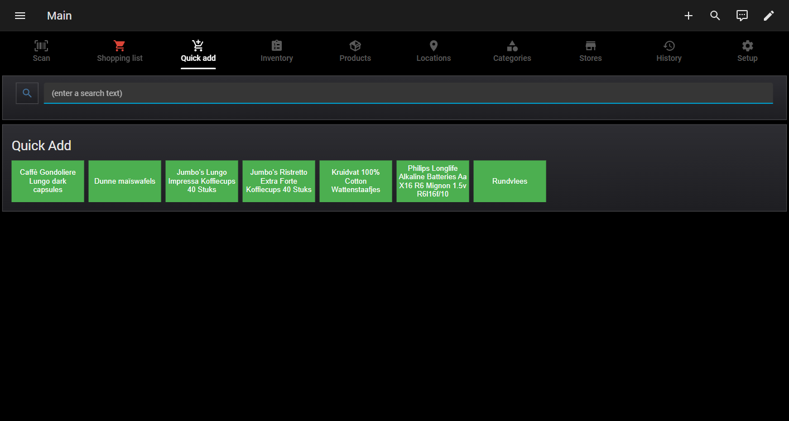

- **Add to Shopping List** — products that are *not* yet on the list. Tapping a product adds it.
- **Remove from shopping list** — products already on the list. Tapping a product removes it.

Products move between the two sections automatically as you tap. Use the search box to narrow
the buttons by name.

---

## 5b. Quick Inventory

The **Quick Inventory** tab lets you adjust stock with a single tap, split into two sections:

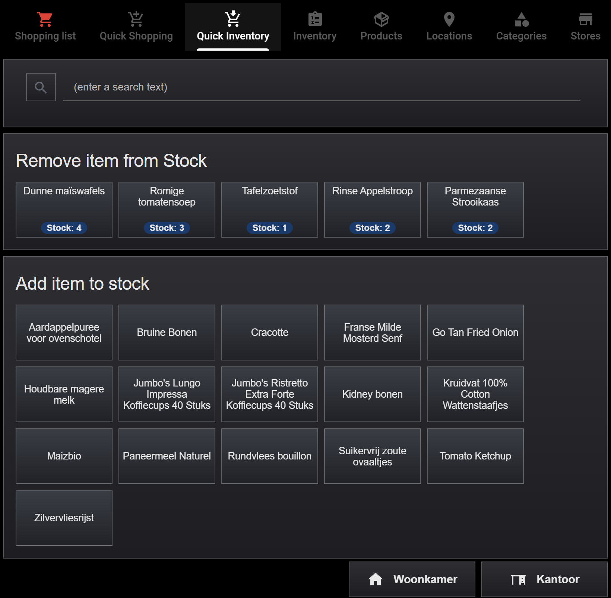

- **Remove item from Stock** — in-stock products (quantity > 0), each showing its current
  **Stock:** count on a blue badge. Tapping decrements the stock by 1; when a product hits 0 it
  drops off this section.
- **Add item to stock** — catalogue products that are *not* currently in stock. Tapping adds the
  product to inventory (quantity 1), after which it moves to the *Remove item from Stock* section.

Use the search box to narrow the buttons by name.

---

## 6. The shopping list

The **Shopping list** tab holds what you need to buy.

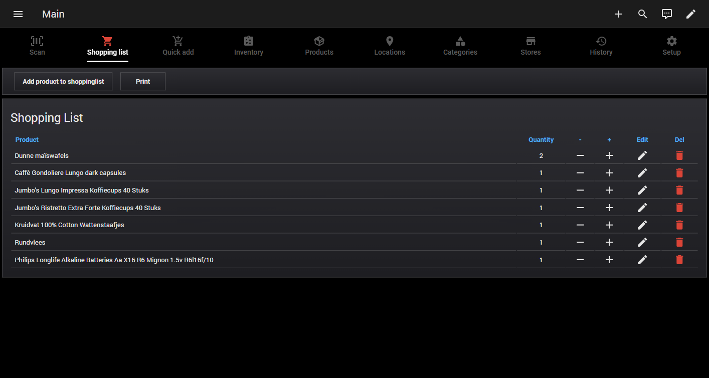

- Add items with the **Add item** button, which opens the **Quick Shopping** tab (tap products
  to add them to the list). **Auto-Add** can also populate the list automatically when stock
  runs low.
- Adjust quantities with the **+ / –** buttons. Pressing **–** on an item at quantity 1
  removes it from the list (there are no separate edit/delete controls on this tab).
- When the shopping list contains items, the cart icon is highlighted (styling cue).

### Printing the shopping list

Press **Print** to send the list to the connected **Epson TM-T20II** (ESC/POS) thermal
printer. The receipt is organised **per store**: each store from the Stores tab prints as a
header followed by its items, and a final **Algemeen** section lists everything with no store
assigned (or set to *All*). Add or rename stores on the Stores tab and the next printout
reflects the change automatically.

---

## 7. Scanning workflow

The **Scan** tab is the fastest way to update inventory using a barcode scanner (or by
typing a barcode). When you open the Scan tab, the cursor automatically lands in the
**Barcode** field so you can scan straight away.

### Add vs. Use

After entering a barcode, choose an action:

- **Add** — you are *putting an item in* (bought/restocked). Increases stock.
- **Use** — you are *consuming an item*. Decreases stock; when the last one is used the
  product leaves the inventory. If the product is set to auto-add (or you *Use* something
  you no longer have in stock at all), it is placed on the shopping list.

Each scan creates a row in the **Scan Queue** with a **State**:

| State | Meaning |
|---|---|
| **Exist** | The barcode matches a product already in your catalogue. The action is applied directly. |
| **New / Lookup** | The barcode was resolved online (Open Food Facts / UPC Item DB) and pre-filled details are available to create the product. |
| **Unknown** | The barcode could not be resolved online. You resolve it manually (see below). |
| **Manual** | Reserved for manual handling. |

The **Source** column shows which provider resolved the item; the **Resolve** column offers
an action to (re)resolve a row.

### Resolving an Unknown barcode

When a scan can't be resolved automatically, its row shows the **Unknown** state with a
**Resolve** (wrench) action. Pressing it opens a product pop-up pre-filled with the
unresolvable barcode. Enter the product details and save:

- If the original action was **Add**, the new product is created and stocked
  (quantity 1).
- If the original action was **Use**, the product is created and added to the shopping list
  (at its auto-add quantity). No stock row is kept, so it does not show up in the inventory.

The scan-queue row is removed once resolved. Completed scans are cleared automatically.

> **Heads-up:** if the *Unresolved scan* announcement/notification is enabled on the Setup
> tab, an Unknown barcode also triggers a spoken (TTS) announcement and/or a mobile push so
> you know a manual entry is waiting.

### Handheld (MQTT) scanner

Besides the on-screen Scan tab, a physical **handheld barcode scanner** (an ESPHome device
publishing over MQTT) can update stock hands-free. Every barcode published to the configured
topic (*Setup → Handheld scanner → MQTT topic*, default `barcode/scanned`) is processed
using the current mode set by the [Inventory-tab toggle](#handheld-scanner-mode-add--use):

- **Add mode** — behaves like a Scan-tab **Add**: known barcodes increase stock; unknown
  barcodes are resolved online and queued to create the product.
- **Use mode:**
  - product **in inventory** → stock is decreased by 1;
  - product **known but not in inventory** → added to the shopping list;
  - product **unknown** → the barcode is looked up online, saved to the product database and
    added to the shopping list; if it can't be resolved, it follows the manual-resolution
    routine above.

Scan outcomes can trigger the shared, decoupled **spoken announcements (TTS)** and **mobile
notifications** configured on the Setup tab (e.g. the *Used from inventory* and *Unresolved
scan* announcements) — these fire for every scanner, not just the handheld.

### Large screen barcode scanners (ESPHome)

The system also supports two purpose-built **Large screen barcode scanners** — ESP32-based
devices (**Barcode-01** and **Barcode-02**) with a 2.8" touchscreen and a GM67 scanner
module, built with ESPHome and LVGL. From their on-device UI you pick **Add**, **Use**, or
**Print** mode and scan; each scan fires a Home Assistant event that this solution's
automations process exactly like any other scanner, pushing the product name, description,
and stock back to the device's screen.

Their firmware lives in [`esphome/`](../esphome), hardware reference material in
[`hardware/`](../hardware), and full documentation (build environment, wiring, user flow,
and GM67 configuration) in the **[Large screen barcode scanners guide](SCANNER.md)**.

A second scanner family — a **[Small screen barcode scanner with printer](SCANNER-SMALL.md)**
(scanner-01, ESP8266 + OLED + thermal printer) — is also supported and documented separately.

---

## 8. History (audit log)

Every add, edit, and delete is recorded on the **History** tab with a timestamp, the
action, the affected entity, its id, and a detail string. Use it to trace what changed and
when.

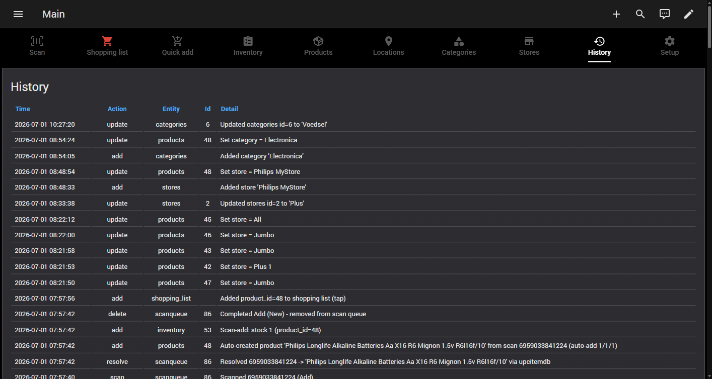

The tab shows the **latest 50 entries**. Behind the scenes, history rows older than
**3 months** are purged automatically, so the log stays a useful recent trail without
growing without bound.

---

## 9. Settings & language (Setup tab)

The **Setup** tab holds application settings: the **Language** selector, a **Show ID
columns** toggle, a **Hide header (kiosk)** toggle, a **Handheld scanner** section, a
**Similarity checking** section, and the **Spoken announcements (TTS)** and **Mobile
notifications** sections.

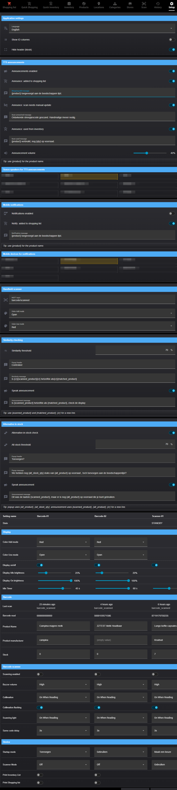

### Show ID columns

Off by default. Turn it on to reveal the database **ID** column on every table (useful for
troubleshooting or cross-referencing); toggling it updates all tables instantly.

### Hide header (kiosk)

Turns kiosk mode on/off for the VH-Inventory dashboard. When on, the Home Assistant top bar
(header) is hidden for a clean, full-screen touchscreen view; when off, the header returns.
The change applies live via the kiosk-mode plugin — the first time after install you may need
a single hard refresh (Ctrl+F5).

### Switching language

Pick a language from the **Language** dropdown. The entire interface — tabs, table titles,
column headers, pop-up titles, buttons, and field labels — switches **instantly**. Your
data (product names, locations, categories, etc.) is never translated.

Here is the **Products** tab with the language set to **Nederlands**:

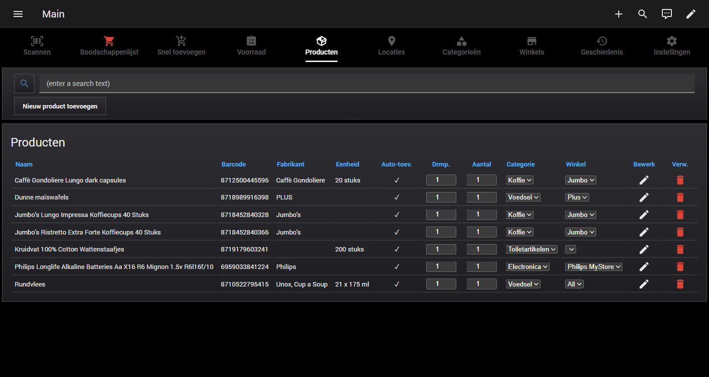

Notice that the chrome is translated (*Producten, Naam, Fabrikant, Eenheid, Categorie,
Winkel, Bewerk, Verw., Toevoegen*) while the product data stays exactly as entered.

> **Adding more languages:** drop a new `translations/<code>.json` file, add its display
> name to the language selector, and rebuild the dashboard. See the Installation Guide,
> section 10.

### Spoken announcements (TTS)

Optional Dutch voice announcements play through your Sonos speakers via the
[Chime TTS](https://github.com/nimroddolev/chime_tts) integration. They run **independently
of the core inventory logic**, so a slow or offline speaker never blocks or delays scanning.

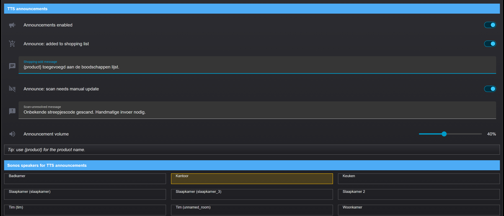

- **Enable announcements** — master on/off switch for all spoken announcements.
- **Sonos speakers for TTS announcements** — pick which speakers play the announcements
  (multi-select chips; tap to toggle).
- **Volume** — slider that sets the announcement volume. Any media already playing on a
  target speaker is briefly interrupted for the announcement and then resumes.
- **Per-announcement switches** — turn each announcement on/off individually:
  - *Product added to shopping list* — says "&lt;product&gt; toegevoegd aan de
    boodschappenlijst."
  - *Used from inventory* — when a product is consumed (via **any** scanner) and stock
    remains, says "&lt;product&gt; verbruikt, nog &lt;qty&gt; op voorraad."
  - *Unresolved scan* — announced when a scanned barcode can't be resolved and needs
    manual entry.
- **Editable message text** — each announcement's wording is editable in its own input
  field. Use the `{product}` placeholder to insert the product name, and `{qty}` (in the
  *Used from inventory* message) to insert the remaining stock.

### Mobile notifications

Optional push notifications to the Home Assistant companion app, configured just like TTS
and equally decoupled from the core logic:

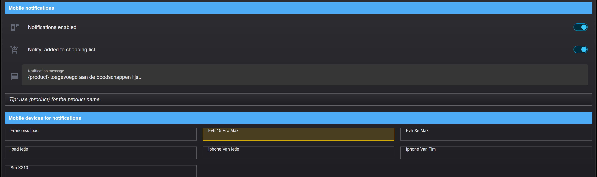

- **Enable notifications** — master on/off switch.
- **Mobile devices for notifications** — pick which devices receive the push. The list is
  built automatically from the `mobile_app_*` notify services registered in your Home
  Assistant.
- **Per-notification switch & editable text** — the *product added to shopping list*
  notification, with its own on/off switch and editable message text.

Spoken announcements and mobile notifications listen to the same internal event, so if both
are enabled a product added to the shopping list triggers a spoken announcement **and** a
push notification.

### Handheld scanner

Configuration for the physical [handheld (MQTT) scanner](#handheld-mqtt-scanner):

- **MQTT topic** — the topic your ESPHome scanner publishes barcodes to (default
  `barcode/scanned`). Editing it re-subscribes the backend automatically; no restart needed.
- **Color Add mode / Color Use mode** — the colours of the Inventory-tab mode toggle for
  each mode (defaults cyan for Add, red for Use). Pick from the shared colour palette.

Handheld scan outcomes are announced through the shared, scanner-agnostic *Spoken
announcements (TTS)* and *Mobile notifications* sections above — there are no longer any
handheld-specific notification messages.

### Similarity checking

When a product is scanned in **Add** mode, its resolved name is compared against the products
already on the shopping list. If a close match is found, an informative pop-up is raised on
the large-screen scanner (`barcode-01`) asking whether the scanned item is the same product
bought in a different shop. This helps avoid creating duplicate entries for the same product
under slightly different names (e.g. *Campina magere melk* vs *Houdbare magere melk*).

- **Similarity threshold** — the minimum match score (0–100 %) required to raise the pop-up.
  Lower it to catch looser matches, raise it to only flag near-identical names. Default `70`.
  The scorer is a hybrid of character-level and shared-word (token-set) similarity, so
  products that share their core words score high even when the brand/prefix differs.
- **Popup header** — the title shown on the pop-up. Default *Similar product found*.
- **Similarity message** — the pop-up body text. Use the `{scanned_product}` placeholder for
  the just-scanned product name and `{matched_product}` for the matching shopping-list item.
  Insert `{cr}` anywhere to force a line break. Default *Is {scanned_product} similar to
  {matched_product}*.

The pop-up's **Yes/No** buttons are readable from Home Assistant but are not acted on yet —
this step only surfaces the prompt.

All Setup-tab settings are backed by input helpers and **persist across Home Assistant
restarts**.

---

## 10. Tips & behaviours

- **Autofocus:** selecting the Scan tab focuses the Barcode field automatically — no extra
  click needed before scanning.
- **Handheld scanner:** a physical MQTT scanner adds or consumes stock hands-free; toggle
  **Add / Use** mode from the Inventory tab and set its topic/colours on the Setup tab.
- **Search by name or barcode:** table search boxes match on either the product name or the
  barcode (any partial match).
- **Quick tabs:** *Quick Shopping* adds/removes products on the shopping list; *Quick Inventory*
  removes-from or adds-to stock. Buttons share the dark glass style of the touchscreen dashboards.
- **Printing:** the shopping list prints grouped per store; the inventory prints grouped per
  category (filtered to the selected category, or all). Both use the ESC/POS thermal printer.
- **Pop-ups close on Save:** Add/Edit dialogs close themselves after a successful save.
- **Cascade delete:** deleting a product cleans up its inventory and shopping-list rows.
- **Shopping list:** pressing **–** at quantity 1 removes the item from the list.
- **History retention:** the tab shows the latest 50 entries; rows older than 3 months are
  purged automatically.
- **Kiosk mode:** the *Hide header (kiosk)* toggle on the Setup tab shows/hides the HA top bar.
- **Footer navigation:** two right-aligned footer buttons jump to the **Woonkamer** and
  **Kantoor** touchscreen dashboards.
- **Decoupled notifications:** spoken (TTS) announcements and mobile push notifications run
  independently of the core inventory logic, so they never block or slow down scanning.
- **Duplicate-name guard:** locations, categories and stores must be unique.
- **Self-healing data model:** the database and any new columns are created automatically;
  you never run SQL by hand.

---

## 11. Data model (reference)

| Table | Key columns |
|---|---|
| `products` | name, barcode, manufacturer, unit, auto_add_enabled, auto_add_threshold, auto_add_quantity, category_id → categories, store_id → stores |
| `stock` | product_id → products, location_id → locations, quantity |
| `shopping_list` | product_id → products, quantity |
| `locations` | location (unique) |
| `categories` | category (unique) |
| `stores` | store (unique) |
| `scan_queue` | barcode, action (Add/Use), state (New/Lookup/Unknown/Manual/Exist), name, manufacturer, description, unit, category, image_url, provider |
| `history` | timestamp, action, entity, entity_id, detail |

Each table is published to a matching `sensor.vh_inventory_*` entity that the dashboard
reads.
