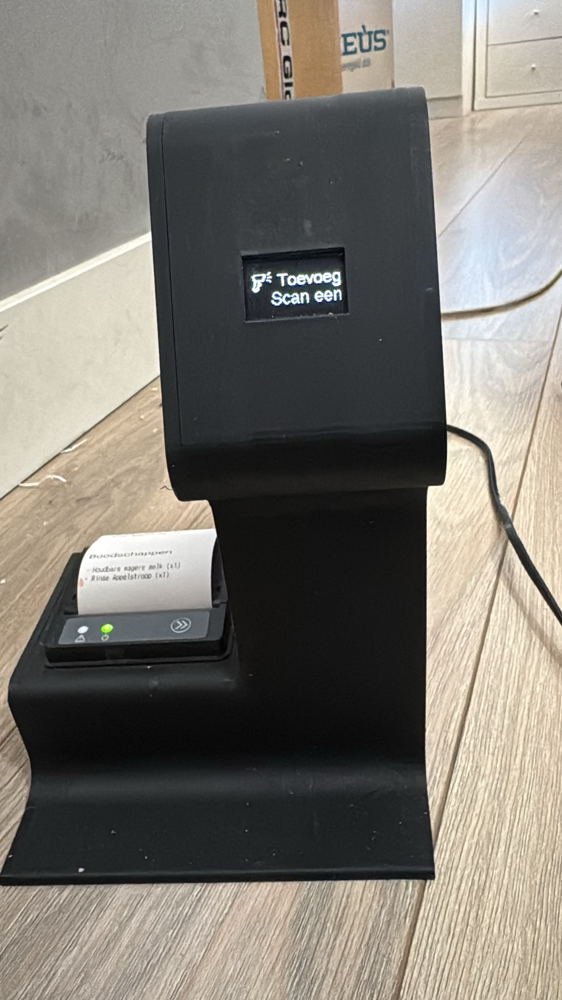

# Small screen barcode scanner with printer (ESPHome)

> **Status: mostly documented.** This describes the **Small screen barcode scanner with
> printer** (**scanner-01**). Device photo, controls, on-device user flow and the device
> state model are documented below; the thermal-printer wiring diagram and per-component
> hardware reference material are still to be added.

This is a second, distinct scanner family for VH-Inventory, separate from the touchscreen
[Large screen barcode scanners](SCANNER.md) (Barcode-01 / Barcode-02). It pairs a small
OLED display with an integrated **thermal printer**, so it can both scan products and print
lists directly.

## Overview

An **ESP8266**-based barcode scanner with an integrated thermal printer, built with
**ESPHome**. It connects a **GM67 barcode scanner module** and a **UART thermal printer** to
**Home Assistant**, with a small **SSD1306 OLED** for on-device status/feedback and two
buttons + two LEDs for control.

Firmware project: `vanhemert.scanner01`, version **1.14**.

## Device Photos

| scanner-01 — armed in **Toevoegen** (Add) mode, printing a shopping list |
|:---:|
|  |

The OLED shows the current mode on the top line (**Toevoeg**…/Toevoegen) and **Scan een
product** below; the integrated thermal printer at the bottom has just printed a
*Boodschappen* (shopping) list.

## Firmware

| File | Device |
|------|--------|
| [`esphome/scanner-01.yaml`](../esphome/scanner-01.yaml) | scanner-01 |

The config references its WiFi credentials and API encryption key via ESPHome `!secret`
(`wifi_ssid2`, `wifi_password2`, `scanner_01_api_encryption_key`) — provide these in your
ESPHome `secrets.yaml` before flashing.

> ✅ **API key:** both the repository and the production copies of `scanner-01.yaml` use
> `key: !secret scanner_01_api_encryption_key`, with the value stored in the ESPHome
> `secrets.yaml`. When flashing on a fresh setup, make sure that secret is defined. The
> effective key is unchanged, so the `!secret` form only takes effect on the next
> ESPHome build/flash of the device.

## Hardware (from the firmware config)

| Component | Details |
|-----------|---------|
| MCU | ESP8266 (`esp01_1m` board) |
| Display | SSD1306 OLED via I²C (address `0x3C`, SDA `GPIO04`, SCL `GPIO05`) |
| Scanner | GM67 barcode/QR module via UART (RX `GPIO03`, TX `GPIO01`) |
| Printer | UART thermal printer (RX `GPIO14`, TX `GPIO12`) |
| Inputs | Two buttons (`GPIO00`, `GPIO02`) |
| Indicators | Two LEDs (`GPIO13` left, `GPIO15` right) |

Minimum ESPHome version: `2024.11.0`.

## Home Assistant integration

- **API** with encryption key for HA connectivity.
- Exposes a `write` action/service to support **printing** from Home Assistant.
- Uses the same VH-Inventory backend (this repository) to look up scanned products and drive
  the inventory — see the [Installation Guide](INSTALLATION.md).
- **Entities** are exposed with the `scanner_01_` object-id prefix, aligned to the
  Barcode-01 / Barcode-02 structure (`<domain>.scanner_01_<suffix>`), e.g.
  `switch.scanner_01_scanning_enabled`, `select.scanner_01_scanner_mode`,
  `number.scanner_01_idle_timer`, `sensor.scanner_01_state`.

## Controls (buttons & LEDs)

| Control | Role |
|---------|------|
| **Left button** | Turns the scanner (GM67 module) **on/off** — toggles `switch.scanner_01_scanning_enabled`. |
| **Left LED** | Follows scanner power: **on** = armed/READY, **off** = STANDBY. |
| **Right button** | Toggles the scan **mode** — `select.scanner_01_scanner_mode` between **Toevoegen** (Add) and **Gebruiken** (Use). |
| **Right LED** | Mode indicator: **off** = Add, **on** = Use. |

Power and mode are independent. The **Startup Mode** select
(`select.scanner_01_startup_mode`) applies on boot to force Add/Use or keep the last mode.

## User flow

1. **Boot** → `CONNECTING`, then `STANDBY` — display shows **Uit**, the GM67 module is off.
2. **Press the left button** → armed (`READY`): the display shows the mode
   (Toevoegen/Gebruiken, scrolling if too long) + **Scan een product**. The idle-off timer
   starts.
3. **Scan a barcode** → `SEARCHING` (**Zoeken**) while the barcode is looked up via the
   VH-Inventory backend; the result screen then shows the product name (scrolling) +
   **Voorraad: &lt;qty&gt;** and returns to `READY`. The scan fires a Home Assistant event
   (`esphome.scanner_product` or `esphome.scanner_generic`) with the barcode and
   `device: "scanner-01"`.
4. **Press the right button** at any time to switch between Add and Use.
5. **Idle-off** → the **Idle Timer** number (`number.scanner_01_idle_timer`, config) resets
   on every scan; when it expires the GM67 module is switched off → back to `STANDBY`.
   Pressing the left button powers it off manually as well.

## Device states

scanner-01 exposes a single lifecycle **State** text sensor
(`sensor.scanner_01_state`). This state model is scanner-01 specific — Barcode-01/02 have no
equivalent (they use LVGL pages plus a brightness-only idle mode).

| State | Meaning |
|-------|---------|
| `UNAVAILABLE` | Powered down / offline. Not published by the device — Home Assistant shows any ESPHome entity as *unavailable* automatically when the device is disconnected. |
| `CONNECTING` | Powered on but not yet connected to WiFi and/or Home Assistant. |
| `STANDBY` | Connected to HA, but the GM67 module (`switch.scanner_01_scanning_enabled`) is **off**. Display shows **Uit**. Resting state; press the left button to arm. |
| `READY` | Connected and armed: scanning enabled (left button pressed). Display shows the mode + **Scan een product**. The idle-off timer runs. |
| `SEARCHING` | A barcode was just scanned and is being looked up. Display shows **Zoeken**. Transient sub-state of `READY` — returns to `READY` once the result is shown. |

> ℹ️ The exposed **State** is derived centrally from the internal `screen_mode` text sensor
> (single source of truth): `connecting → CONNECTING`, `standby → STANDBY`,
> `ready → READY`, `scanned → SEARCHING`, `result → READY`.

## TODO (future work)

- [x] Document the on-device user flow (scan → add/use, printing, button roles).
- [x] Add device photos to `docs/images/scanner/`.
- [ ] Document the thermal-printer wiring and the specific printer model used.
- [ ] Add hardware reference material (ESP8266 pinout, SSD1306, printer) under `hardware/`.
